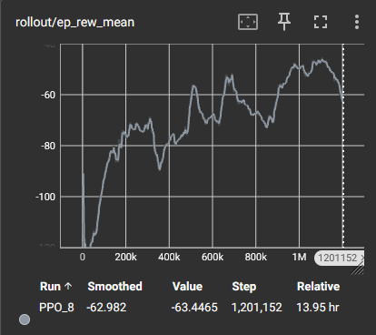
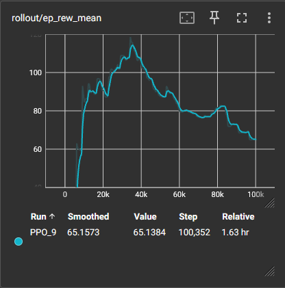
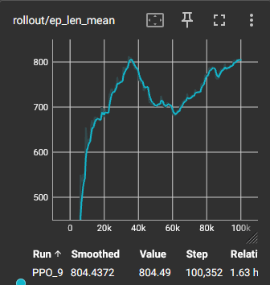
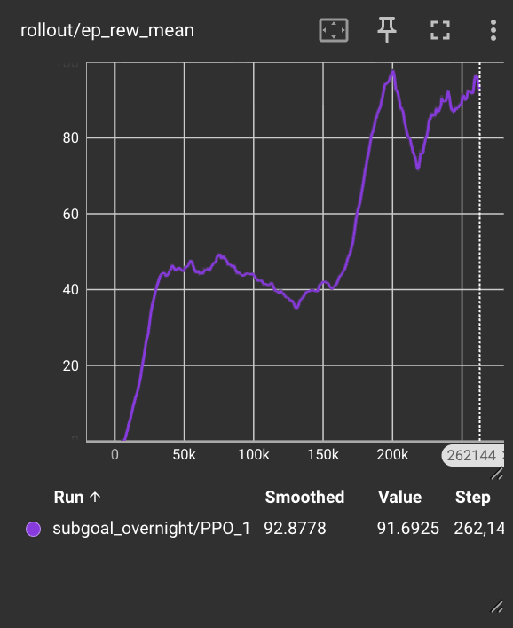

# Create New World:

## Getting Started

MCSRAI began as an idea: create an AI model that is able to speedrun Minecraft. During COVID, with
nothing to do, many people took to speedrunning Minecraft, reviving the interest. And recently, with
the introduction of a mod, "MCSR: Ranked", the hobby/event has blown up once more. Allowing people
to get a physical rank attached to their performance, along with large content creators attempting
runs themselves, Minecraft Speedrunning is reaching its highest peak since the pandemic.

The concept of creating an AI model to speedrun Minecraft was enticing to say the least, and that is
where we began MCSRAI.

Soon after getting the idea, we began to think about how we would train the model. Speedrunning is
quite complex, with many major milestones to achieve, all while making many micro-decisions and making
precise calculations in real-time.

We broke down speedrunning into these major milestones:

- Food and Bucket
- Enter Nether
- Bastion
- Ender Pearls
- Fortress and Blaze
- Exiting Nether and Triangulating Stronghold
- Find End Portal
- Kill Dragon & Complete Speedrun

With each of these major milestones, we figured that this would be too much for our knowledge and
capability. As such, we needed to eliminate milestones which were too challenging, such as killing the
dragon, blazes, and the bastion. These tasks relied on the NPC's algorithm, which would potentially
create confounding variables in our training. Along with these "combat" milestones, we elimiated the
major navigation-based tasks, being finding the bastion, fortress, and stronghold. We decided the
nuances of finding these structures would be beyond our skill level.

This left us with two milestones: "Food and bucket" and "Enter Nether".

We decided on the most important/iconic of the milestones: Entering the Nether.
It's a massive milestone in any speedrun, usually being the first "split" of the run and
marking the potential for any good run.

## Taking Inventory

First, we had to decide our goals, and as prompted by the first report, we chose our baseline goal to just create the portal frame. Our target would be to perform a nether portal run on a set seed and the reach goal would be to achieve this on random seeds.

So, we set out to find any tools for training models regarding Minecraft. This led us to MineRL [Guss et al., 2019], an open source RL tool for Minecraft which utilizes "MalMo", Microsoft's tool for AIs in Minecraft, MineRL allows the creation of a Minecraft environment in which the agent can observe, modify, and, well, play Minecraft!

However, MineRL is sligtly outdated, but luckily, it led us to a more updated tool, MineDojo [Fan et al., 2022]. This quickly became the backbone of our entire project. As a more modern tool, it allowed us to a different observation space, voxels, which would become our most relied on form of interaction with our agent.

# A Quick Intro to a MineDojo Environment

The MineDojo environment is a Minecraft world in which the Malmo agent is able to run and input commands. The choices the agent can take is the "action space", with basic movement inputs like "WASD" and "Spacebar". This also includes item management inputs like "1-9" and "E". Furthermore this also includes camera movement, allowing the agent to move the head left, right, up, and down. The observation space is two main parts: the voxel space and the RGB pixel frame. The voxel space is a 9x9x9 block area around the agent, denoting each Minecraft block within each tile in this space. The RGB pixel frame is a 2D array, with each entry being the RGB value of the pixel at that location (x,y) in the frame of the display.

# Methods

## Proximal Policy Optimization

**Proximal Policy Optimization** (PPO) [Schulman et al., 2017] is an on-policy actor-critic algorithm that updates the policy by maximising a clipped surrogate objective, preventing any single update from changing the policy too drastically. For our task, PPO was the natural choice for several reasons. First, our action space is a **compound** **MultiDiscrete([3,3,4,25,25,8,244,36])** representing simultaneous movement, camera, and functional actions — DQN is fundamentally incompatible with this structure as it requires enumerating Q-values over every possible action, which at roughly 47 million combinations is **computationally intractable**. SAC, while effective in continuous control, was designed for Box action spaces and lacks stable discrete support in standard implementations. Second, our reward function changes during training via the curriculum — the misplaced block penalty ramps from 0 to 1.0 over 200,000 steps — and PPO's on-policy nature means every gradient update is computed on experience collected under the current reward signal, keeping the policy and reward function in sync. An off-policy method like SAC would contaminate its replay buffer with transitions collected under an earlier, weaker penalty, muddying the curriculum signal. Finally, PPO's ent_coef parameter gave us direct control over the exploration-exploitation tradeoff, which proved critical when the model first exhibited learned helplessness — raising entropy from 0.01 to 0.05 was a hyperparameter that would not be possible in a value-based framework like SAC.

To implement PPO in our initial models, we utilized Stable-Baseline3 [Raffin et al., 2021] and its default parameters.

# Approach and Evaluation

To begin, we began with a very basic agent, no policy yet, just randomly select from all actions in our MultiDiscrete([3,3,4,25,25,8,244,36]) action space, masking impossible actions, and letting it roam free.

## Stone Age

As we began to train, we noticed issues. First off, we needed to redefine our "start state". With the default environment, the terrain wasn't flat. This could cause our agent to create "bad" portals, despite it thinking it was (attached video is example ADD TS FROM BEFORE).

<video controls src="./videos/randomagent.mp4" type="video/mp4" width="600" height="400">
Your browser is old as hell
</video>

So, we changed our "start state" to begin on a superflat world. This would create completely flat and replicable terrain for our agent to train on. But with this came the fact that there is no method to create a portal in this superflat world. So, we gave the agent the nescessary resources to begin building.

Initially, we looked at the base choice: random. Take a random input from the action space, and do it. Do this over 10000 timesteps, and see what happens. As expected, this model was terrible! It did a whole lot of nothing, tossing items around, opening the inventory endlessly, and other inefficient inputs. And as such, we decided to redefine the action space.

We mask our action space even more, like dropping items, opening inventory, and settings for example. This would make our agent to always pick some input that guided us towards completion.

With these basic things in mind, we were able to begin really training a model that would build a portal.

## Aquire Hardware

With our redefined start states, we could begin to train this model, primarily using PPO.
We initalized a basic policy:

By rewarding the model for placing obsidian, our model learned to place obsidian.

- Reward: Place obsidian; +1

By punishing the model for taking damage, we prevented the model from lighting itself with the flint and steel (and avoid dying!)

- Punishment: Take damage; -0.1

However, as we trained, we observed the model learned to place all the obsidian, although haphazardly.
<video controls src="./videos/ppo_obsidian-step-9000-to-step-9500.mp4" type="video/mp4" width="600" height="400">
ur browser sucks
</video>

We were making progress, avoiding deaths from fire and placing obsidian, but the models were not close to creating a valid portal frame. Despite this, we were moving towards our goal and this was a good first step.

# Ice Bucket Challenge - Reward Shaping

So, to avoid the model from sporadically placing obsidian, we shape our rewards. To prohibit "bad" placement of obsidian, we punished the model for each obsidian that did not conform to a valid frame, checking using the voxel space. But, to encourage valid frames, we rewarded for correct location of obsidian. Furthermore, we also added a punishment for each timestep during training, which we used to push the model to choose actions earlier.

- Reward: Proper frame location; +2
- Punishment: Improper frame location; -1 | Timestep ; -0.01

This led us to the following graph:

** A Preface: All the future graphs will have the total reward value in the negatives. This is expected and due to the punishment for timesteps **

As we observed, the model began very poorly, still haphazardly placing obsidian; the old model accumulated many punishments. But as we continued to train the model, we observed our scores improving!

This was exciting to observe on Tensorboard, seeing the total reward begin to rise! We had began to create a "good" model!

## Hot Stuff

Pike syndrome is a term created by behavioural biologists. They placed an aggressive Pike in a tank with multiple prey fish, but with a glass wall between them. The Pike, seeing prey, darted towards the fish, but slammed into the glass. Repeatedly. Eventually, the Pike became docile. And even with the glass removed the pike would not attempt to eat the prey fish. Even swimming by the pike's mouth would not garner a reaction.

Why is this relevant to our model?

It's because we gave our model Pike syndrome.

<video controls src="./videos/1mtimesteps.mp4" type="video/mp4" width="600" height="400">
ur browser sucks
</video>

As our inital model was terrible, it accumulated tons of punishment. So, as we trained it on the new reward/punishment system,iIt learned to never place "bad obsidian" by simply not placing any obsidian. This way, it never accumulated its previous punishments and the reasoning behind our seemingly improving scores.

It learned to not do anything. By mucking around, the model would be able to maximise its reward by reducing its punishments.

# We Need to Go Deeper

This issue with our model's "learned helplessness" is attributed to our reward shaping. We thought these were logical choices for reward/punishment, however, we were not thinking like a computer program, we were thinking like humans.

So, we tried something a little more dynamic rather than static.

By dynamically shaping our reward system during the training, we could attempt to reinforce good behaviour at a certain step and later reduce bad behavior.

This led us to a new system:

## Phase 1: Any Obsidian is Good Obsidian (0–100k steps)

In this phase, the model receives +0.5 for every obsidian block placed, regardless of where it lands. No penalties. No geometry checks. Just a simple, unambiguous signal: placing blocks = good.

## Phase 2: Not Just Anywhere (100k–200k steps)

With the model now committed to placing blocks, we introduced a soft penalty of -0.5 for any obsidian placed outside a valid frame position. Critically, the +0.5 flat reward remains active — a misplaced block still earns something, it just earns less than a correctly placed one. The model is never punished into inaction; it is nudged toward better choices while still being rewarded for trying.
This phase acts as a transition. The model begins to notice that some placements feel better than others, without ever hitting the sharp negative signal that caused learned helplessness in the first place

## Phase 3: The Frame (200k+ steps)

In the final phase, the full reward signal activates. Blocks placed on one of the 14 valid nether portal frame positions earn an additional +2.0 on top of the flat reward, making correct placement worth +2.5 total versus +0.5 for a misplaced block. The model now has a clear target and the training history to pursue it without collapsing back into passivity.

# Sucess?

not really.

We observe the model actually decrease in the reward in the first 100k steps, curiously due to the fact that we removed the punishment for getting hurt. We see episode length stagnant:

This, likely is likely because it is killing itself, shortening its life on the environment. This is where we ended our training, as it wouldn't unlearn this behavior, since we never will punish for getting hurt or episode length.

# A Different Approach

By this point, we noticed our previous model had basically learned the wrong lesson. Instead of learning how to build a portal, it had learned to spin around wildly and place obsidian wherever it could. It was getting reward for placing blocks, but it was not learning the structure of a valid frame. So while it looked like we were making progress, the model was really just getting better at random placement.
<video controls src="./videos/ppo_obsidian-step-9000-to-step-9500.mp4" type="video/mp4" width="600" height="400">
Your browser does not support the video tag.
</video>

At this point, we started to think that the issue was not just the reward system, but also the way the model was allowed to move. Even after simplifying the action space, the camera movement was still far too messy. The agent would look in strange directions, turn too much, and lose track of where it had already placed obsidian. For a task like portal building, that was a huge problem.

So, we changed the action space again. Rather than letting the model control random low level camera movement, we switched to a smaller set of discrete actions. Instead of trying to learn every possible pitch and yaw movement, the model could now choose simple actions like look left, look right, look up, look down, move, place obsidian, jump and place obsidian, and ignite the portal. This made the camera much smoother and made the task much easier to learn.

<video controls src="./videos/RnadomlyPlacingBlocks.mp4" type="video/mp4" width="400" height="400">
Your browser does not support the video tag.
</video>

From there, we also split the task into phases. First came the build phase. In this phase, the model only had to make the obsidian frame. If it tried to use the flint and steel too early, that action would be blocked and punished. Then came the light phase. Once the frame was complete, the model was encouraged to switch to the flint and steel and ignite the portal. Successfully lighting the portal gave a large reward of +40.

Even with this change, the model still had trouble finishing the full frame consistently. It would often start well, but then drift away and place blocks in bad positions. Still, by around 50k timesteps, we could see that the model had at least learned one useful behavior: it was now intentionally placing obsidian blocks rather than just wandering around aimlessly.

<video controls src="./videos/differentapproach50k.mp4" type="video/mp4" width="400" height="400">
Your browser does not support the video tag.
</video>

So, we broke the build phase down even further into smaller subgoals. Completing the bottom row gave a reward of +4. Completing the left side gave +3. Completing the right side gave +3. Completing the top row gave +4. The goal here was to stop treating the portal like one big all or nothing task, and instead reward the model for making progress piece by piece.

But this led to another issue. The model seemed to figure out that the easiest reward to exploit was the bottom row reward. Rather than building the sides and finishing the portal, it kept repeating the bottom row pattern again and again. Instead of making a frame, it would place four obsidian in a row, then another four, then another four, creating a long line of obsidian across the ground. By around 200k timesteps, the model looked much more deliberate than before, but it was still exploiting this bottom row behavior rather than truly completing the portal.

<video controls src="./videos/differentapproach200k.mp4" type="video/mp4" width="400" height="400">
Your browser does not support the video tag.
</video>

It is possible that this was partly a programming mistake on our end. Our bottom row check may have been too generous, or the reward may have triggered in situations we did not fully intend. But more importantly, it showed us a much bigger lesson about reinforcement learning. Even when a reward system feels logical to us, the model may still find a loophole that maximizes reward without solving the actual task.

This graph reflects that progression quite well. In the early stages of training, the model improved quickly because it learned a simple useful behavior, which was placing obsidian blocks instead of doing nothing. After that, the reward curve leveled off for a long stretch, showing that while the model was making progress, it still had not learned how to consistently build a proper portal frame. Then, around 170k to 200k timesteps, the reward rose sharply, which suggests the model had begun to act more deliberately and was benefiting from the subgoal based reward structure. Even though the score later dipped and recovered, the overall trend stayed much higher than before, ending near a reward of 90 by about 262k steps. In other words, the graph shows that the subgoal based approach did help the model learn more stable and purposeful behavior, but it also supports our conclusion that higher reward did not always mean true task completion, since the model could still exploit parts of the reward system without fully solving the portal building problem.

# Limitions and Future Improvemtns

## Limitations

Admittedly, what limit our model most was not our hardware, but our code.

Even though our code would take almost days to get a reasonable place, our reward shaping and observation space was what took brunt of our computation power. Processing voxel space and rgb space took too long, and restricted our ability to train and develop better models and reward shapes. In the future, it might be best to leave the rgb space out of our observation space, since it didn't contribute towards our rewards/reward shaping, which was mostly determined by our voxel space observations.

Hardware was a contributing factor in our iterating of our model. We weren't able to train and iterate on models, since each run would take many hours, many of those iterations not giving us much insight to how our reward shaping helped or didn't help, resulting in slow progress through our code.

MineDojo was probably our biggest limitation, particularly our setup and computation. One of our group members was unable to get MineDojo imported locally and thus we missed another person to iterate on our models. Even more, MineDojo did not like running on Colab. We are still unsure of why, but our suspicions lie in Malmo and Colab's headless nature.

## Improvements and Changes

### 3D CNNs

A 3D CNN could add spatial locatlity, to our voxel space. It could learn shapes like a nether portal in the voxel space.

### A Change of Pace

If all we were focused on was the performance of our agent, we would switch off of MineDojo and PPO in general. The best performing and state of the art models for Minecraft involve behavioral training and cloning, both of which were not allowed in this project, but would provide the best result in terms of building a nether portal, which was the original goal.

**OpenAI's Video Pre-Training** [Baker et al., 2022] is the largest and most well-known example of behavior cloning and perhaps even RL in Minecraft in general. Trained on nearly 70,000 hours of human gameplay, we see that it trains a transformer-based model to imitate human actions using an IDM to extract human inputs to in-game actions. We see outstandingly human and fantastic performance for objectives like aquiring a diamond pickaxe.

This would have the highest potential for actually being able to do our original goal, speedrunning Minecraft.

## Resources Used:

Towers, M., Terry, J. K., Kwiatkowski, A., Balis, J. U., Cola, G. D., Deleu, T.,
Goulão, M., Kallinteris, A., KG, A., Kuzmins, M., Perez-Vicente, R., Pierré, A.,
Schulhoff, S., Tai, J. J., Tan, A. J. S., & Younis, O. G. (2023).
Gymnasium.
Zenodo.
https://doi.org/10.5281/zenodo.8127026

Paszke, A., Gross, S., Massa, F., Lerer, A., Bradbury, J., Chanan, G., Killeen, T.,
Lin, Z., Gimelshein, N., Antiga, L., Desmaison, A., Kopf, A., Yang, E., DeVito, Z.,
Raison, M., Tejani, A., Chilamkurthy, S., Steiner, B., Fang, L., Bai, J., & Chintala, S. (2019).
PyTorch: An Imperative Style, High-Performance Deep Learning Library.
Advances in Neural Information Processing Systems, 32, 8024–8035.
https://pytorch.org

Harris, C. R., Millman, K. J., van der Walt, S. J., Gommers, R., Virtanen, P.,
Cournapeau, D., Wieser, E., Taylor, J., Berg, S., Smith, N. J., Kern, R., Picus, M.,
Hoyer, S., van Kerkwijk, M. H., Brett, M., Haldane, A., del Río, J. F., Wiebe, M.,
Peterson, P., … Oliphant, T. E. (2020).
Array programming with NumPy.
Nature, 585, 357–362.
https://doi.org/10.1038/s41586-020-2649-2

Raffin, A., Hill, A., Gleave, A., Kanervisto, A., Ernestus, M., & Dormann, N. (2021).
Stable-Baselines3: Reliable Reinforcement Learning Implementations.
Journal of Machine Learning Research, 22(268), 1–8.
http://jmlr.org/papers/v22/20-1364.html

Fan, L., Wang, G., Jiang, Y., Mandlekar, A., Yang, Y., Zhu, H., Tang, A.,
Huang, D., Zhu, Y., & Anandkumar, A. (2022).
MineDojo: Building Open-Ended Embodied Agents with Internet-Scale Knowledge.
Advances in Neural Information Processing Systems, 35, 18343–18362.
https://minedojo.org

## References:

Schulman, J., Wolski, F., Dhariwal, P., Radford, A., & Klimov, O. (2017).
Proximal Policy Optimization Algorithms.
arXiv preprint arXiv:1707.06347.
https://arxiv.org/abs/1707.06347

Guss, W. H., Houghton, B., Topin, N., Wang, P., Codel, C., Veloso, M., & Salakhutdinov, R. (2019).
MineRL: A Large-Scale Dataset of Minecraft Demonstrations.
Proceedings of the 28th International Joint Conference on Artificial Intelligence (IJCAI).
https://arxiv.org/abs/1907.13440

## Video Walkthrough:

The full video walkthrough for our project can be viewed here:

